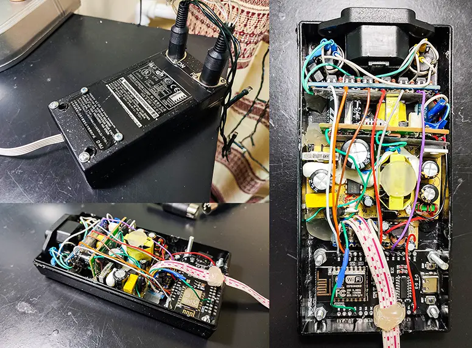
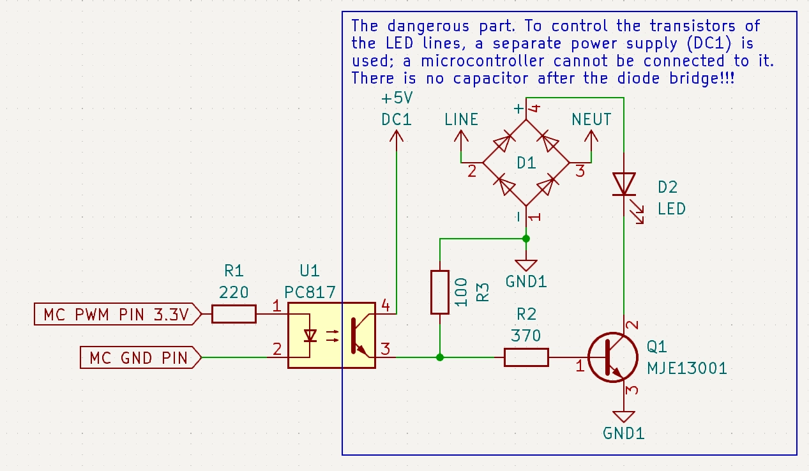
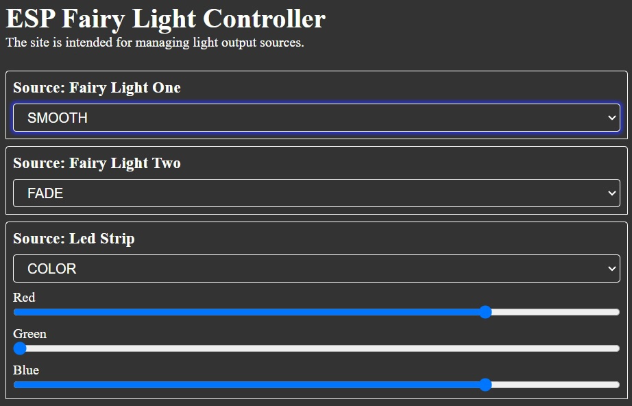

# ESP Fairy Light Controller

The project implements a programmable garland controller, which is controlled via Wi-Fi. 
The backend of the microcontroller does not use JSON, like the frontend. 
Raw bytes are used for data transfer, and state machines are used for reading.

At the moment, the project is under development, but its state already 
allows you to connect many sources and channels and configure them with each other. 
You are limited only by the number of pins. Management is carried out through the 
website using JS Fetch, which allows you to fully manage the garland now.

Currently supported ESP8266 and ESP32.

### System Appearance

[Full Size Photo](docs/system-appearance.webp) 

### Optocoupler Circuit

### Site Design
